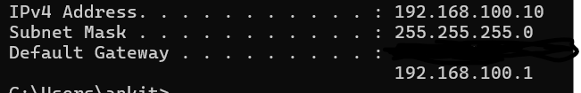

How many end devices can your network support?

Ans:

Network Address : 192.168.100.0

Broadcast Address: 192.168.100.255

For class C IP , N:N:N:H

where N = network bit

H = host bit

Network bits =24

Host bits = 8

Hence, supported end devices= 2^8 -2=254

Subtracted 2 cause one for Network Address and one for Broadcast Address